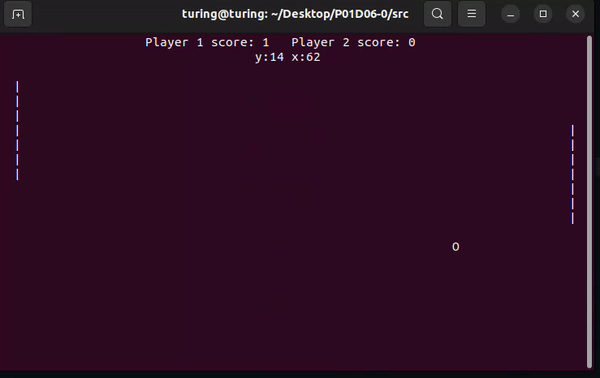

# pong.c 




### Please make terminal size approximately 80x25 (size of phone screen)

### Commands:

player 1: A for up, Z for down
player 2: K for up, M for down

press P to pause
press Q to quit and see score


How to compile: 
```sh
$ make
```
How to play:
```sh
$ ./pong
```