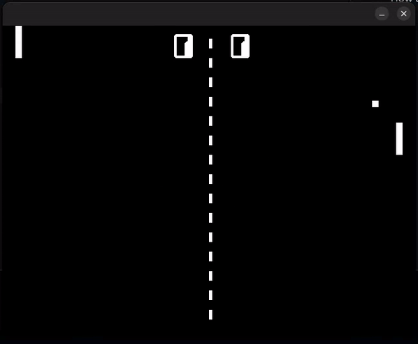

# Bonus Pong Using SDL



### Notice:

You must have SDL installed. Works on Ubuntu 22.04 LTS

Learn more about SDL here: [www.libsdl.org](https://www.libsdl.org/)


To install on Ubuntu: 
```sh
$ sudo apt-get install libsdl2-2.0
$ sudo apt-get install libsdl2-dev
```


### Commands:

player 1: A for up, Z for down
player 2: K for up, M for down

press esc to quit


How to compile: 
```sh
$ make
```
How to play:
```sh
$ ./bonus_pong
```

